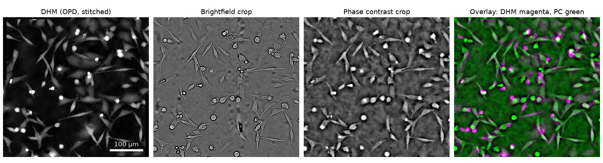

# Stitch-batch-BF-PC

Fiji macro that stitches every multi-field well of an IN Cell Analyzer plate, for brightfield and phase contrast together, and builds a labelled plate mosaic per channel in a single run. Wells that can't be stitched are tiled side by side instead of coming out broken.

The repository also contains [`Crop_BF-PC_to_DHM.ijm`](#crop-bf-and-pc-to-the-dhm-field-of-view), which crops the brightfield and phase contrast images to the field of view of a DHM image of the same well.


## Features

- **Shared registration.** Brightfield and phase contrast are registered once (2-channel, then BF, then PC) and fused with the same positions, so both outputs of a well align exactly.
- **No broken wells.** Each registration is checked against the expected grid. If every attempt fails, the tiles are placed side by side and the well is marked `*` in the mosaic.
- **Positions from metadata.** The `.xdce` file provides the field positions and pixel size for each well, at any magnification and for irregular layouts. Plates acquired edge to edge (0 % overlap) are tiled without stitching.
- **Even contrast per well.** BF tiles are flat-field corrected and PC tiles get their background offset removed. One contrast range is then applied to the whole well.
- **QC and speed.** You get a per-well CSV report, a Log summary with the measured overlap and a progress window. Processing takes about 4 s per well for both channels.

## Installation

Requires [Fiji](https://fiji.sc/) (tested with ImageJ 1.54p and Stitching 3.1.10, which is bundled) and ≥ 4 GB of memory.

Copy [`Stitch_batch-all-wells_Phase-contrast_and_Brightfield.ijm`](Stitch_batch-all-wells_Phase-contrast_and_Brightfield.ijm) to `Fiji.app/plugins/`, then restart Fiji. The macro appears as *Plugins › Stitch batch-all-wells Phase-contrast and Brightfield*.

## Input

One folder per plate holding the raw TIFF/PNG files, named with the IN Cell pattern, plus the `.xdce` file (recommended):

```text
TL and PC_1/
├── TL and PC_1.xdce
├── B - 03(fld 1 wv TL-Brightfield - Cy3 wix 2).tif
├── B - 03(fld 1 wv TL-Phase Contrast - Cy3 wix 1).tif
└── …
```

- The well is the text before `(`.
- The field number follows `fld `.
- The name must contain `Brightfield` or `Phase Contrast`.

## Usage

Run the macro, choose the input folder and keep the defaults. With 2 × 2 fields and *Right & Down*, fld 1 is top-left and fld 4 bottom-right.

| Parameter | Default | Description |
|---|---|---|
| Target Channel | Both | Both channels with a shared registration, or a single channel |
| B&C Saturation (%) | `auto` | 1.5 for BF, 1.0 for PC; a number applies to both |
| Overlap (%) | `auto` | Read from `.xdce`. Without metadata, 6 %. A number forces a regular grid. |
| Grid Size X / Y, Grid Order | 2 / 2, Right & Down | Acquisition grid; only fields 1 to X × Y are used |
| Min. overlap to stitch (%) | 1 | Below this overlap, wells are tiled side by side |
| Max tile shift (% of tile) | 10 | A registration that moves a tile further than this from its expected position is rejected |
| Mosaic scale | 0.33 | Size of each well in the plate mosaic |

## How it works

1. **Expected positions.** Each tile's position is computed from the `.xdce` field offsets. The average overlap decides whether stitching is attempted.
2. **Correction.** BF tiles are divided by a Gaussian-blurred copy (σ = 50 px). PC tiles have their median subtracted. The well's combined histogram sets one contrast range for all its tiles.
3. **Registration.** Fiji's *Grid/Collection stitching* runs on the combined BF + PC tiles, then on BF alone, then on PC alone. A result is kept only if every neighbour offset is within *Max tile shift* of the expected one. On a difficult plate, this cut unstitched wells from 16 (BF only) and 20 (PC only) to 5 out of 280.
4. **Fallback.** When fields share too little content, the plugin silently drops tiles at (0, 0), which gives black quadrants or collapsed strips. Such results are rejected and the tiles are placed side by side.
5. **Output.** Both channels are fused (linear blending) at the same positions, then the thumbnails are assembled into one mosaic per channel.


## Outputs

Written inside the input folder:

```text
Merged_Images_Brightfield/      <well>(wv …)_merge.tif (16-bit) + Stitching_report.csv
Merged_Images_Phase Contrast/   same for phase contrast
Mosaics/                        Mosaic_Brightfield.tif, Mosaic_Phase Contrast.tif
```

`Stitching_report.csv` has one row per well with these columns:

- Well
- Tiles
- Result: stitched, or tiled side by side with the reason
- Registration used
- Max tile shift (px)
- Rejected registrations

The Log summarises the outcome, the measured overlap and the timing.

**Tested** on three IN Cell 2200 plates:

- 20x, 0 % overlap: 280 wells tiled side by side, where the original macro produced about 100 broken images.
- 20x, 5–7 % overlap: 280/280 wells stitched.
- 10x, irregular layout: 4/4 wells stitched.

## Troubleshooting

| Symptom | Solution |
|---|---|
| Many wells tiled side by side | Too little overlap; check *Measured overlap* in the Log. Acquire with 5–10 % field overlap. |
| `Overlap below 1%: stitching skipped` | The metadata says the fields are edge to edge. Type an overlap value to force stitching. |
| Positions don't match the grid size/order | Fix Grid Size/Order, or type an overlap value to ignore the metadata |
| `No '...' images with valid well names` | Check the file-name pattern (see [Input](#input)) |

## Versions

- **3.1:** per-well contrast, per-well positions from metadata (10x, irregular layouts), 2.4× faster, progress window.
- **3.0:** BF and PC in one run with a shared registration.
- **2.2:** `Mosaics/` folder.
- **2.1:** overlap from `.xdce`.
- **2.0:** registration check with side-by-side fallback, and the CSV report.

The full changelog is at the top of the macro.

## Crop BF and PC to the DHM field of view

[`Crop_BF-PC_to_DHM.ijm`](Crop_BF-PC_to_DHM.ijm) finds, for every well, the area imaged by the DHM (digital holographic microscope) in the IN Cell images of the same well. It then saves brightfield and phase contrast crops covering exactly that area, resampled onto the DHM pixel grid so they overlay the DHM image pixel to pixel.



**Input** (only the first two folders must be chosen; the others are found in the BF + PC folder):

| Folder | Content |
|---|---|
| DHM stitched images | One image per well, `<Well>_….tif` (e.g. `B03_00001_00001.tif`); pixels equal to 0 are empty areas |
| BF + PC single fields | Raw IN Cell fields, including the field acquired at the DHM position (default fld 5) |
| `Processed_BG_Corrected_Brightfield/` | Background-corrected BF fields (optional: the macro can correct the raw BF itself) |
| `Merged_Images_Brightfield/`, `Merged_Images_Phase Contrast/` | Fields 1–4 stitched by the macro above |

**Usage:** install it like the stitching macro (or use *Plugins › Macros › Run…*), choose the DHM folder and the BF + PC folder, and keep the defaults. Options: registration channel, DHM pixel size and rotation (`auto` or fixed), output on the DHM pixel grid or as a plain crop at BF/PC resolution, and the BF source (corrected folder, raw corrected by the macro, or raw).

**How it works**

1. **Registration.** The DHM image is scaled to the BF/PC pixel size, rotated and band-pass filtered. It is then located in the phase contrast image by masked normalised cross-correlation (FFT, 4× down-sampled). BF and PC share the same position.
2. **Field choice.** If the whole DHM area lies inside fld 5, both channels are cropped from fld 5. Otherwise they are cropped from the stitched fld 1–4 images.
3. **Scale and rotation** are measured on the first wells (`auto`), because the pixel size stored in DHM files can be wrong (0.300 µm in the file, 0.275 µm measured at 20x).
4. **Plate model.** The DHM position varies smoothly across the plate. Wells without a clear match are searched again within ±50 µm of the position predicted from the other wells, and the predicted position is used if nothing matches there.

**Outputs** (`Cropped_to_DHM/` in the BF + PC folder):

```text
Brightfield/<DHM name>_BF.tif      Phase Contrast/<DHM name>_PC.tif      16-bit, same size as the DHM image
QC/<DHM name>_QC.jpg               DHM (magenta) over the PC crop (green)
Crop_report.csv                    per well: source image, how the position was found, match score, position
```

The position is reproducible to about 5 px (1.5 µm). Cells move between the DHM and IN Cell acquisitions (4.5 h on the test plate), so single cells don't overlay exactly. Wells positioned from the plate model are marked in the report; check their QC overlays.

**Tested** on a 384-well plate (280 wells, 20x): all wells cropped, 85 from fld 5 and 195 from the stitched images, in 25 min.

## Citation

Stitching uses Fiji's *Grid/Collection stitching* plugin. Please cite: Preibisch S, Saalfeld S, Tomancak P. *Bioinformatics* 25(11):1463–1465 (2009). [doi:10.1093/bioinformatics/btp184](https://doi.org/10.1093/bioinformatics/btp184)
