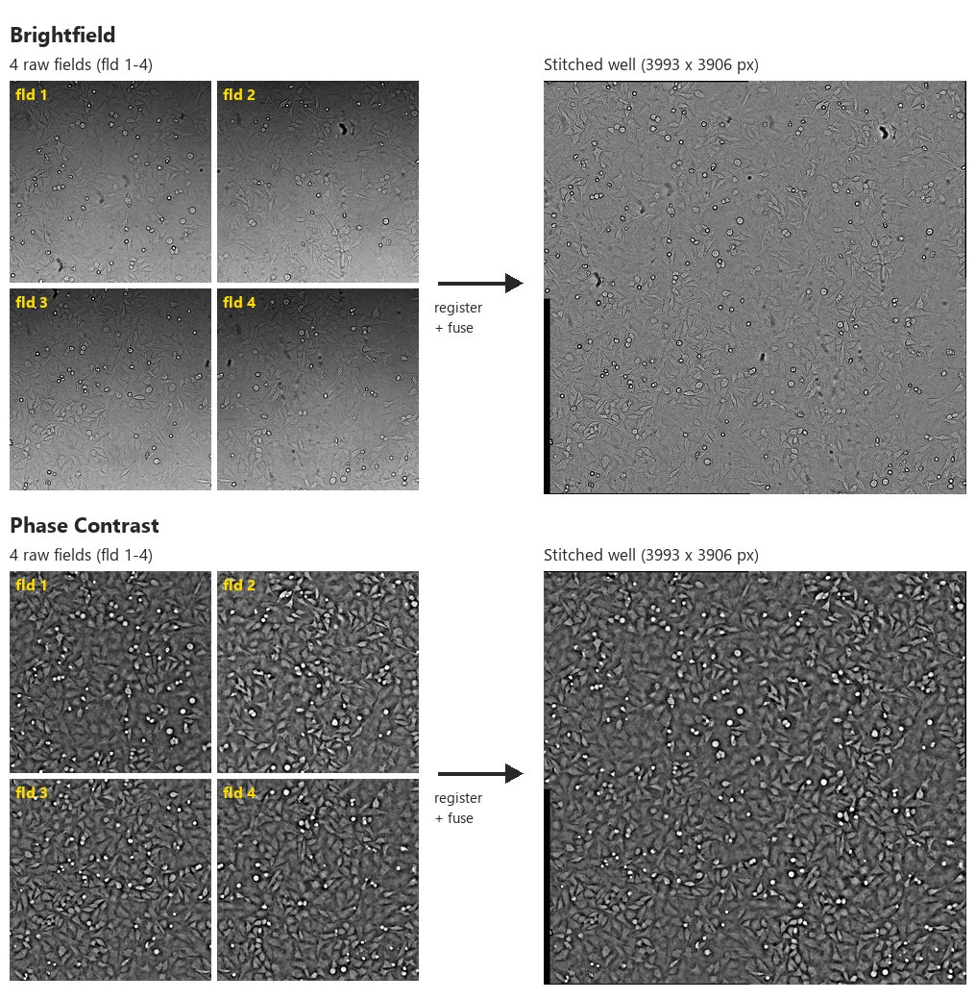
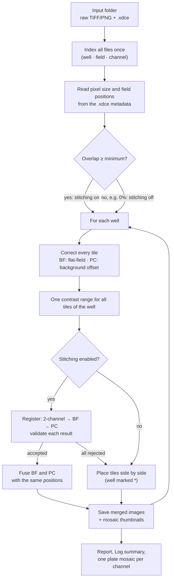
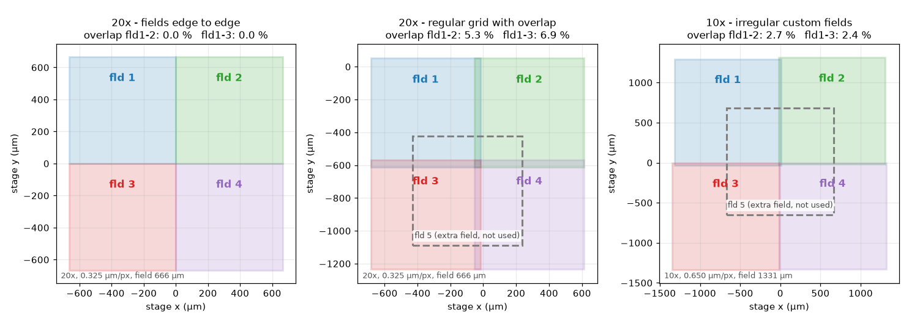
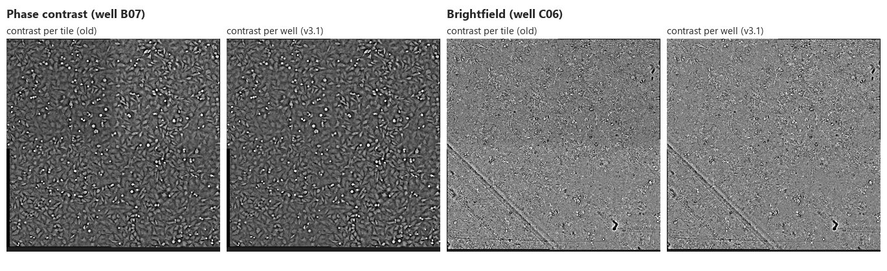
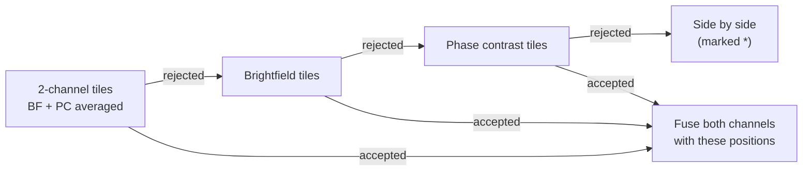
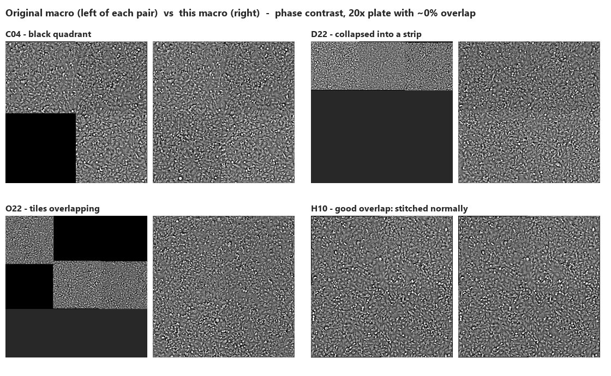
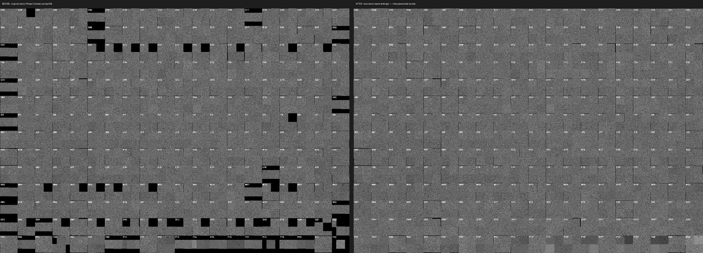

# Stitch-batch-BF-PC

**Batch stitching of multi-field wells and plate mosaics for Fiji, for brightfield and phase contrast plates (IN Cell Analyzer).**

The macro takes a folder of raw well images (several fields per well, two transmitted-light channels), stitches every well, and builds a labelled overview mosaic of the plate for each channel, in a single run. It reads the field positions from the IN Cell `.xdce` metadata, checks every stitching result, and falls back to a clean side-by-side layout when stitching is not possible, so a plate never ends up with broken wells.



## Contents

- [Features](#features)
- [Requirements](#requirements)
- [Installation](#installation)
- [Input data](#input-data)
- [Quick start](#quick-start)
- [Dialog parameters](#dialog-parameters)
- [How it works](#how-it-works)
- [Outputs](#outputs)
- [Validation and performance](#validation-and-performance)
- [Troubleshooting](#troubleshooting)
- [Limitations and ideas](#limitations-and-ideas)
- [Version history](#version-history)
- [Acknowledgements](#acknowledgements)

## Features

- **Both channels in one run.** Brightfield and phase contrast are registered once and fused with the same tile positions, so the two outputs of a well always line up exactly.
- **Robust registration.** Each well is registered on the combined brightfield + phase contrast tiles first, then on each channel alone, and the first result that passes a geometry check is kept.
- **No broken wells.** When neighbouring fields share too little image content, Fiji's stitching drops tiles at the origin (black quadrants, collapsed strips). The macro detects this and places the tiles side by side instead, marking the well with `*` in the mosaic.
- **Overlap and tile positions from metadata.** With `auto`, the field positions and pixel size come from the `.xdce` file of each well. This works at any magnification (tested at 10x and 20x) and for irregular field layouts. Plates acquired edge to edge (0% overlap) are tiled without stitching.
- **Consistent contrast within each well.** Brightfield tiles are flat-field corrected, phase contrast tiles are corrected for their background offset, and one contrast range is applied to all tiles of a well: no brightness steps between tiles.
- **QC built in.** A per-well report (`Stitching_report.csv`), a summary in the Log including the overlap actually measured, and a progress window with remaining time.
- **Fast.** Files are indexed once, registration and fusion of both channels take a single plugin call per well in the common case, and mosaics are built from thumbnails made on the fly (about 4 s per well for both channels on a 12-core workstation).

## Requirements

- [Fiji](https://fiji.sc/) (tested with ImageJ 1.54p and the bundled *Grid/Collection stitching* plugin, Stitching 3.1.10). No extra update site is needed.
- Enough memory for a few 2048 × 2048 tiles per well: a Fiji maximum memory of 4 GB or more is comfortable (*Edit › Options › Memory & Threads*).
- Optional but recommended: the IN Cell Analyzer `.xdce` metadata file in the image folder.

## Installation

1. Download [`Stitch_batch-all-wells_Phase-contrast_and_Brightfield.ijm`](Stitch_batch-all-wells_Phase-contrast_and_Brightfield.ijm).
2. Copy it into the `plugins` folder of your Fiji installation (e.g. `Fiji.app/plugins/`).
3. Restart Fiji, or use *Help › Refresh Menus*.
4. The macro appears in the *Plugins* menu as **Stitch batch-all-wells Phase-contrast and Brightfield**.

Alternatively, open it with *Plugins › Macros › Run…* without installing it.

## Input data

All raw images of a plate are expected in **one folder**, with file names following the IN Cell Analyzer pattern:

```
<Well>(fld <N> wv <...Channel...>).tif
```

| Part | Example | Used for |
|---|---|---|
| Well | `B - 03` | Text before the first `(`; row letter(s) and column number give the mosaic position |
| Field | `fld 1` | Number after `fld `; field 1 is the first tile of the grid |
| Channel | `TL-Brightfield`, `TL-Phase Contrast` | The file name must contain `Brightfield` or `Phase Contrast` |

Example folder:

```
TL and PC_1/
├── TL and PC_1.xdce                                   ← metadata (field positions, pixel size)
├── B - 03(fld 1 wv TL-Brightfield - Cy3 wix 2).tif
├── B - 03(fld 1 wv TL-Phase Contrast - Cy3 wix 1).tif
├── B - 03(fld 2 wv TL-Brightfield - Cy3 wix 2).tif
├── ...
└── P - 22(fld 4 wv TL-Phase Contrast - Cy3 wix 1).tif
```

TIFF and PNG files are accepted. A field is only used if it exists for every channel being processed, and a missing field never shifts the other tiles.

## Quick start

1. Run the macro from the *Plugins* menu.
2. Choose the **Input Folder** containing the raw images.
3. Keep **Target Channel** on *Both (Brightfield + Phase Contrast)* and **Overlap** on `auto`.
4. Check that **Grid Size** and **Grid Order** match your acquisition (default: 2 × 2, *Right & Down*, i.e. fld 1 top-left, fld 2 top-right, fld 3 bottom-left, fld 4 bottom-right).
5. Click **OK** and follow the *Stitching progress* window:

```
[####################--------------------] 50%   140/280 wells
Processing well H - 22   -   elapsed 9m 12s   remaining ~9m 10s
```

At the end, a summary dialog gives the number of stitched and side-by-side wells and where the files are.

## Dialog parameters

| Parameter | Default | Description |
|---|---|---|
| Input Folder | — | Folder with the raw images (and the `.xdce` file). Outputs are written inside it. |
| Target Channel | Both (Brightfield + Phase Contrast) | *Both* registers each well once and applies the same positions to both channels. *Brightfield* or *Phase Contrast* processes a single channel. |
| B&C Saturation Threshold (%) | `auto` | Percentage of saturated pixels in the contrast stretch. `auto` = 1.5 for brightfield, 1.0 for phase contrast. A number applies to both channels. |
| Overlap (%) | `auto` | `auto` reads the field positions of each well from the `.xdce` metadata. Without metadata, a regular grid with 6% overlap is used. A number forces a regular grid with that overlap. |
| Grid Size X / Y | 2 / 2 | Number of fields per row / column. Only fields 1 to X × Y are used. |
| Grid Order | Right & Down | Order in which the fields were acquired (8 patterns). |
| Min. overlap to attempt stitching (%) | 1 | Below this overlap (e.g. 0% from the metadata), stitching is skipped and every well is tiled side by side. |
| Max tile shift vs. expected grid (% of tile size) | 10 | A registration that moves a tile further than this from its expected position is rejected (205 px for 2048 px tiles). |
| Mosaic Downsampling Scale | 0.33 | Size of each well in the plate mosaic (1 = full resolution). |

## How it works



### 1. Tile positions from the metadata

The IN Cell `.xdce` file stores, for every image, the stage position of the field relative to the well centre and the pixel size of the objective. With **Overlap = `auto`**, the expected position of every tile in pixels is computed from these values for each well. The average overlap between neighbouring fields is printed in the Log and decides whether stitching is attempted.



- **Left:** fields acquired exactly edge to edge (0% overlap). Neighbouring tiles share no pixels, so registration cannot work; the macro tiles every well side by side.
- **Middle:** a regular grid with 5–7% overlap. Stitching works well.
- **Right:** a 10x custom layout where every pair has a different overlap (0.1–2.7%) and rows and columns are offset. Using the real position of each field instead of one average overlap keeps registration accurate.

Extra fields beyond the grid (here the centre field 5) are ignored. The actual overlap is often ~2% larger than the nominal one because of stage backlash; the Log reports the overlap measured on the stitched wells.

### 2. Background correction and contrast per well

- **Brightfield:** each tile is divided by a strongly blurred copy of itself (Gaussian, sigma = 50 px) to remove uneven illumination.
- **Phase contrast:** dividing would destroy the halos, but the raw IN Cell phase contrast fields have different background levels (more than 2× apart within one well). The median of each tile is subtracted: only the offset changes, halos and contrast are preserved.
- The contrast stretch is then computed from the histogram of **all tiles of the well** and applied identically to each of them, so tiles have consistent brightness.



On a 20-well test set, the brightness difference between the tiles of a well dropped from 1.8% to 0.1% on average (worst well: 4.7% → 0.3%).

### 3. Registration with fallbacks

Registration uses Fiji's *Grid/Collection stitching* (phase correlation and global optimisation) starting from the expected positions. With both channels, the candidates are tried in this order:



Combining the channels helps because brightfield and phase contrast fail on different wells. On a difficult plate (fields nearly edge to edge, stitching forced at 3% overlap), the number of wells that could not be stitched was:

| Registration | Wells not stitched (of 280) |
|---|---|
| Brightfield only | 16 |
| Phase contrast only | 20 |
| 2-channel only | 8 |
| **2-channel → BF → PC (used)** | **5** |

### 4. Validation and side-by-side fallback

When two neighbouring fields share little or no image content, the stitching plugin rejects their correlation and silently places the unconnected tile at (0, 0), on top of tile 1. The result is a black quadrant, a collapsed strip, or overlapping tiles.

After each registration, the macro reads the registered positions and compares the offset between every pair of neighbouring tiles with the expected offset. If any tile is off by more than **Max tile shift**, the registration is rejected. If no candidate passes, the tiles are placed side by side (no overlap, no blending), the well is listed in the Log and the report, and its mosaic label gets a `*`.



### 5. Fusion, outputs and mosaic

Both channels are fused with linear blending at the validated positions (in a single call for the 2-channel tiles), saved as 16-bit TIFFs, and a downscaled thumbnail is kept for the mosaic. At the end, the thumbnails are assembled into one labelled mosaic per channel, each well cropped to the median well size.



## Outputs

Everything is written inside the input folder:

```
TL and PC_1/
├── Merged_Images_Brightfield/
│   ├── B - 03(wv TL-Brightfield - Cy3 wix 2)_merge.tif
│   ├── ...
│   └── Stitching_report.csv
├── Merged_Images_Phase Contrast/
│   ├── B - 03(wv TL-Phase Contrast - Cy3 wix 1)_merge.tif
│   ├── ...
│   └── Stitching_report.csv
└── Mosaics/
    ├── Mosaic_Brightfield.tif
    └── Mosaic_Phase Contrast.tif
```

- **Merged images:** one 16-bit TIFF per well and channel, named after the first tile without the field number, plus `_merge`.
- **Mosaics:** one labelled plate overview per channel; wells tiled side by side because stitching failed are labelled with `*`.
- **Temporary files** (`temp/`, `temp_thumbnails/`) are deleted at the end of the run.

### Stitching report

`Stitching_report.csv` (identical in both folders) starts with a comment line giving the macro version, channels and overlap, then one row per well:

| Column | Example | Meaning |
|---|---|---|
| Well | `D22` | Well ID |
| Tiles | `4` | Number of fields used |
| Result | `stitched` / `tiled side by side (...)` | Outcome, with the reason when not stitched |
| Registration | `2-channel`, `Brightfield`, `Phase Contrast` | Tiles that gave the accepted positions |
| Max tile shift (px) | `59` | Largest deviation of a tile from its expected position |
| Rejected registrations | `2-channel 2839 px` | Candidates tried before and why they were rejected |

### Log

```
Batch Well Stitching & Mosaic v3.1 - Brightfield + Phase Contrast - C:/.../TL and PC_1/
Overlap from metadata (TL and PC 5 FOV 20x matched with DHM_1.xdce): X 5.3%, Y 6.9% (average); tile positions read from the metadata of each well
Well 1/280 B - 03: stitched with 2-channel registration (max tile shift 90 px)
Well 2/280 B - 04: stitched with 2-channel registration (max tile shift 89 px)
...
=== Stitching summary: 280 wells stitched (2-channel: 280, Brightfield: 0, Phase Contrast: 0), 0 wells tiled side by side ===
Measured overlap X: median 7.5% (10-90th percentile 5.2 to 8.0%)
Measured overlap Y: median 9.1% (10-90th percentile 8.4 to 9.9%)
Total time: 20m 28s (4.4 s per well)
```

## Validation and performance

The macro was tested headless and in the Fiji GUI on three IN Cell Analyzer 2200 experiments:

| Experiment | Wells | Result |
|---|---|---|
| 20x, 4 fields, acquired edge to edge (0% overlap) | 280 | Metadata overlap 0% → all wells tiled side by side. On this plate the original macro produced about 100 broken well images across the two channels (black quadrants, collapsed strips). |
| 20x, 5 fields, regular grid (5.3% / 6.9% overlap) | 280 | 280/280 stitched with the 2-channel registration; image sizes match the earlier results within 0–4 px; brightfield and phase contrast have identical geometry for every well. |
| 10x, 5 fields, irregular custom layout | 4 | 4/4 stitched with the 2-channel registration. |

Speed, both channels, 20 wells on a 12-core workstation: **about 4 s per well** (2.4× faster than v3.0, which processed the same set in 195 s instead of 81 s).

## Troubleshooting

| Symptom | Cause and solution |
|---|---|
| Many wells tiled side by side | The fields share too little image content. Check *Measured overlap* in the Log. For new acquisitions, set a field overlap of 5–10% in the acquisition protocol. |
| `Overlap below 1%: stitching skipped` | The metadata says the fields are edge to edge; tiling side by side is the expected result. Type a number in *Overlap* to force a stitching attempt anyway. |
| `Warning: the field positions in the metadata do not match the selected grid size/order` | Grid Size or Grid Order do not match the acquisition. Fix them, or type an overlap value to ignore the metadata. |
| `Overlap could not be read from .xdce metadata` | No `.xdce` file in the input folder (or an unexpected format). A regular grid with 6% overlap is used; type the correct value if needed. |
| `No '...' images with valid well names` | File names must contain `(`, `fld <N> ` and `Brightfield` or `Phase Contrast`. |
| Some wells look darker as a whole in the mosaic | The contrast is set per well, so wells with very different content (e.g. cell density) get different background levels. Tiles within a well remain consistent. |
| Field 5 (or other extra fields) missing in the output | Only fields 1 to Grid X × Grid Y are used; extra fields outside the grid are ignored. |
| No progress window | The progress window only exists in the Fiji GUI; in headless mode, follow the Log. |

## Limitations and ideas

- Only the two transmitted-light channels (*Brightfield*, *Phase Contrast*) are recognised; other channels are ignored.
- The brightfield flat-field is estimated per tile; a plate-wide flat-field (median of many tiles) would also remove the residual vignetting visible in phase contrast.
- Wells that cannot be stitched are placed side by side rather than at their stage positions.
- Possible next steps: pixel size and provenance written into the output TIFFs, resuming an interrupted run, an optional plate-wide contrast for the mosaic, and compressed outputs.

## Version history

| Version | Main changes |
|---|---|
| 3.1 | Contrast per well (brightfield flat-field, phase contrast background offset); tile positions of each well from the metadata (10x and irregular layouts); about 2.4× faster; progress window. |
| 3.0 | Both channels in one run with a shared registration (2-channel → BF → PC); *Registration* column in the report. |
| 2.2 | Mosaics saved in a dedicated `Mosaics/` folder. |
| 2.1 | Overlap `auto` from the `.xdce` metadata; stitching skipped below a minimum overlap. |
| 2.0 | Validation of every registration with side-by-side fallback; report CSV; all grid fields loaded; bug fixes. |
| 1.0 | Original version. |

The detailed changelog is at the top of the macro file.

## Acknowledgements

Stitching relies on the *Grid/Collection stitching* plugin shipped with Fiji:

> Preibisch S, Saalfeld S, Tomancak P. Globally optimal stitching of tiled 3D microscopic image acquisitions. *Bioinformatics* 25(11):1463–1465, 2009. https://doi.org/10.1093/bioinformatics/btp184

Please cite it if you use this macro in published work.
